 

---

<h2></h2>

Backend and cloud developer based in Medellín, Colombia. I build **REST and serverless APIs** with **Node.js**, **TypeScript** and **Python**, backed by **SQL and NoSQL databases**, and deploy them on **AWS** using **Lambda, API Gateway, S3 and IAM**.

- Focused on clean, readable and maintainable code, with error handling and logging treated as first-class concerns.
- Comfortable across the full backend lifecycle: data modelling, API design, containerization with Docker, and deployment.
- I work with an AI-assisted workflow (**Cursor** and **Claude**) to move faster without giving up code review and understanding.
- Strong on ownership and reliability: I finish what I commit to, and I communicate blockers early.
- Currently pursuing my degree while growing into a specialized backend and cloud engineering role.

**Languages:** Spanish (native) · English (technical reading and writing)

---

<h2></h2>

**Languages**

**Backend**

**Databases**

**Cloud &amp; DevOps**

**Tools &amp; AI-assisted development**

---

<h2></h2>

---

<h2></h2>

I am moving my AWS and Node.js work into public repositories, starting with serverless APIs. This section grows as each project ships.

| Project | What it is | Stack |
| --- | --- | --- |
| [CV](https://github.com/frey-jsp/CV) | Resume generator for anyone: edit a single HTML template and a Node.js script renders it into a print-ready A4 PDF through headless Chrome. Fork it, change the content, run one command and your own resume is ready. | Node.js, Puppeteer, HTML, CSS |

---

<h2></h2>

<table>
<tr>
<td width="65%" valign="middle">

Reading, music, video games and training keep me balanced outside the terminal, and they are usually where I get unstuck on a problem.

And yes, I am a dog person. The ASCII one in the terminal above was not an accident.

</td>
<td width="35%" valign="middle">

</td>
</tr>
</table>

---

<h2></h2>

I am open to backend, cloud and junior full-stack roles, remote or hybrid in Medellín.

